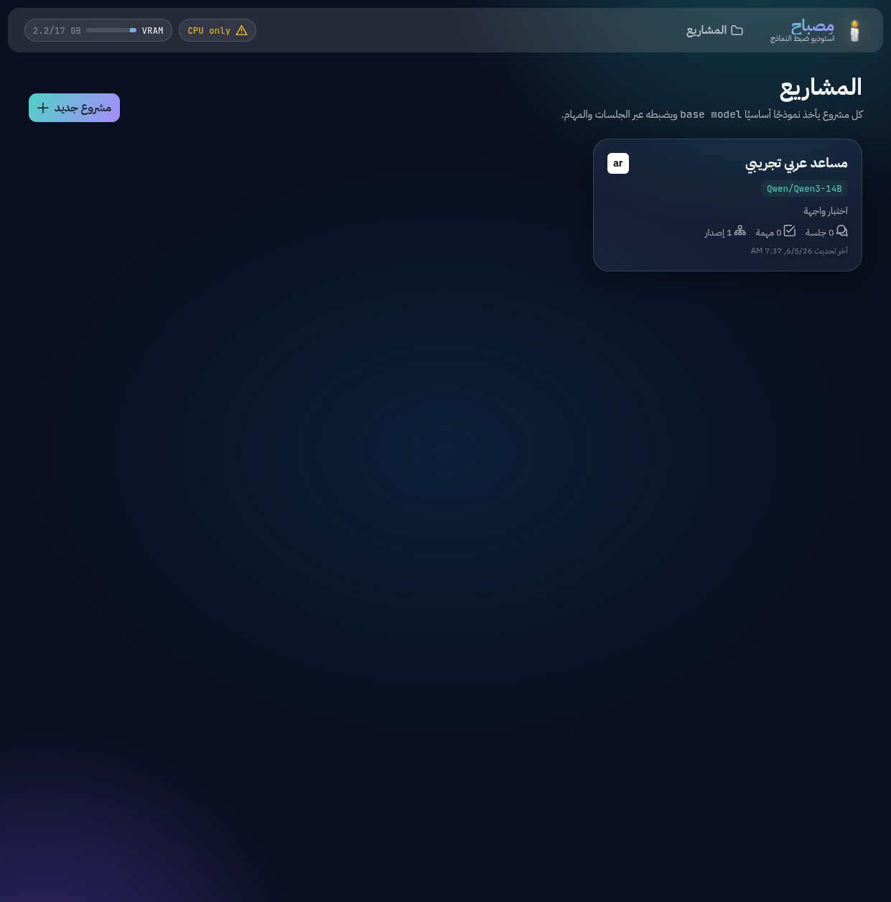
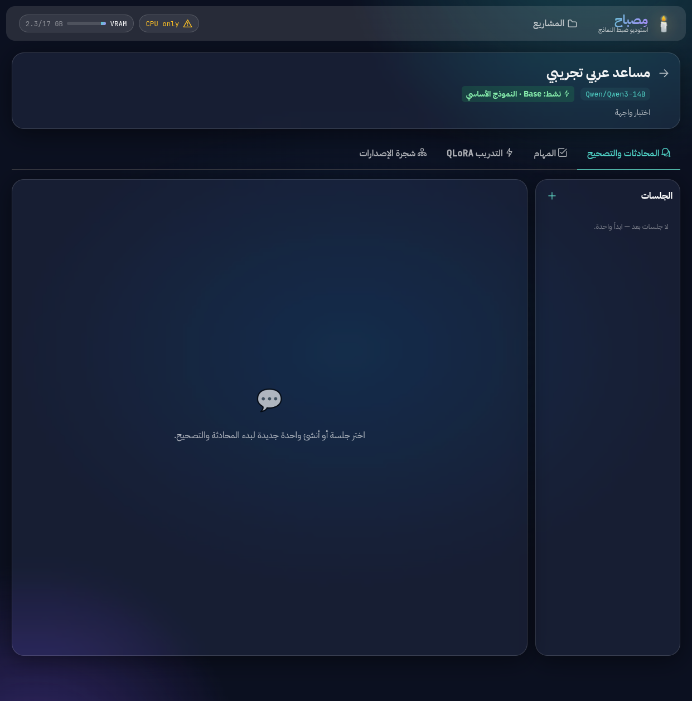

<div align="right">

# 🕯️ مِصباح — Misbah

**استوديو ضبط نماذج الذكاء الاصطناعي للعربية**
*A glassy, RTL studio for fine-tuning an Arabic long-context LLM with QLoRA.*

</div>

---

Chat with an open LLM, **correct** its answers, and turn those corrections into a
QLoRA fine-tune — all from a calm, glassy, Arabic-first interface. Every fine-tune
becomes a node in a **version tree** you can branch, roll back, and keep improving.

| | |
|---|---|
| 🧠 Base model | **Qwen3-14B** (default) / Qwen3-8B — long context, strong Arabic, QLoRA-fits 16 GB |
| 🎛️ Method | **QLoRA** (4-bit NF4) via Unsloth, tuned for **RTX 5080 / Blackwell** |
| 🖥️ GUI | Angular 20 + PrimeNG 20, **RTL Arabic**, glassmorphism, live training charts |
| 🌿 Versioning | Branchable, reversible model **version tree** |
| 💬 Workflow | Project → Sessions (chat + correction) → Tasks → Training → Versions |

## Screens

| Projects | Project workspace (chat · training · version tree) |
|---|---|
|  |  |

## Quickstart

```bash
# Backend  (in the conda env that has torch 2.11+cu130)
cd backend
pip install -r requirements.txt        # API — boots immediately
pip install -r requirements-ml.txt     # ML/QLoRA stack (Blackwell-pinned)
python -m bitsandbytes                  # sanity-check the GPU stack
python scripts/download_model.py Qwen/Qwen3-14B
uvicorn app.main:app --port 8077

# Frontend  (new terminal)
cd frontend && npm install && npm start   # → http://localhost:4200
```

The API runs **without** the ML stack too — the whole authoring experience
(projects, sessions, version tree) works before any GPU setup; chat & training
light up once `requirements-ml.txt` is installed.

## How a fine-tune happens

1. **Create a project** and pick a base model from the curated Arabic-capable list.
2. **Chat** in a session. When the model answers, **edit the answer** to what it
   *should* have said — that correction is now a training example.
3. **Approve** examples; watch the counter grow.
4. **Start a QLoRA run** — watch the live loss curve and VRAM gauge.
5. A new **version** appears in the tree and goes active. Keep enhancing, or roll
   back anytime.

## Docs

- [`docs/MODEL_SELECTION.md`](docs/MODEL_SELECTION.md) — why Qwen3-14B; memory budget; hyper-params.
- [`docs/HARDWARE.md`](docs/HARDWARE.md) — the Blackwell/CUDA-13 QLoRA stack & gotchas.
- [`docs/ARCHITECTURE.md`](docs/ARCHITECTURE.md) — processes, data model, end-to-end flow.
- `CLAUDE.md` files — one per feature, for working in the code.

## Project structure

```
backend/   FastAPI + SQLite + QLoRA subprocess        (backend/CLAUDE.md)
frontend/  Angular 20 + PrimeNG RTL glass UI          (frontend/CLAUDE.md)
docs/      architecture · model selection · hardware
```

> **Language policy:** UI is Arabic & RTL; technical terms (QLoRA, LoRA, adapter,
> loss, VRAM, base model…) stay in English throughout.
